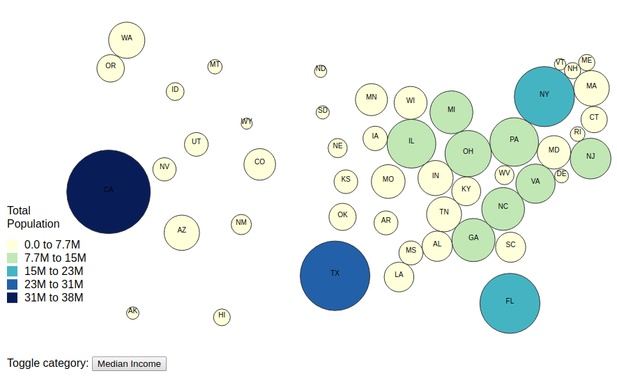
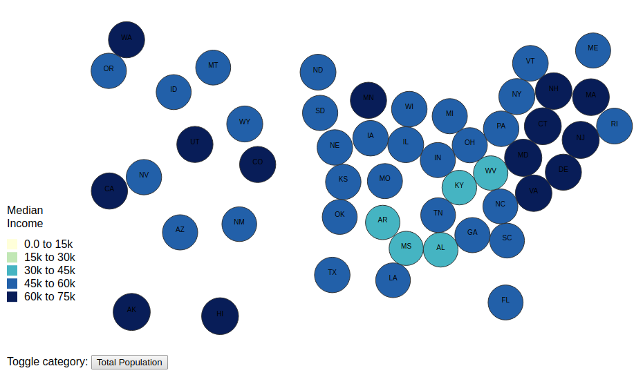

# usa-cartogram-dataviz
## Overview
Dorling Cartogram of US State population and income data using D3.js

In the /data directory, GeoJSON provides state centroid data and US Census dataset provides population/income data. 

## Usage
To interact with this visualization, clone the repo and run a webserver in it, for example:
```
python -m SimpleHTTPServer
```
or, for python3:
```
python -m http.server 
```
## Images 
#### Total Population


#### Median Income

